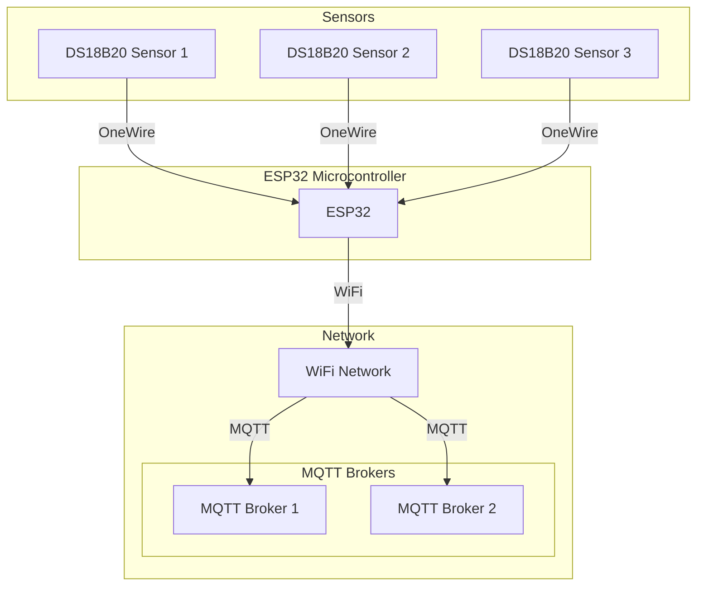
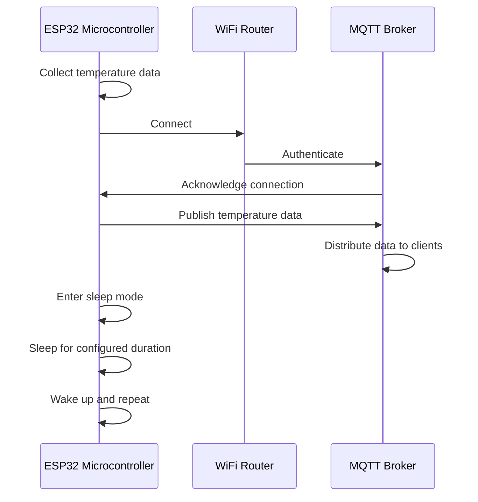

# SNOW : Sensor Network Over WiFi

SNOW is a software project aimed at enabling ESP32 microcontrollers to operate as gateways for DS18B20 temperature sensors. Developed using the ESP-IDF framework, SNOW enables communication between DS18B20 sensors and MQTT brokers over WiFi networks. Focused on simplicity, reliability, and energy efficiency, SNOW provides an solution for IoT applications requiring remote temperature monitoring.

## Table of Contents

- [Features](#features)
- [Getting Started](#getting-started)
- [Domoticz Integration](#domoticz-integration)
  - [Setup](#setup)
- [Configuration](#configuration)
  - [Project Configuration Menu](#project-configuration-menu)
  - [Configuration Options Reference](#configuration-options-reference)
- [License](#license)

## Features

- Support for DS18B20 temperature sensors over the OneWire protocol with multiple sensors connected to a single GPIO pin.
- WiFi connectivity for remote data transmission using station mode (client).
- MQTT support for data transmission to brokers.
- Ability to publish temperature data to MQTT brokers using the Domoticz format for easy integration with Domoticz home automation systems.
- Energy-efficient design incorporating sleep mode functionality.
- Configurable sleep duration to optimize power consumption.
- Straightforward setup and deployment utilizing the ESP-IDF framework.
- Lightweight footprint suitable for resource-constrained environments.

## System Architecture and Communication Overview

The system architecture comprises DS18B20 temperature sensors, an ESP32 microcontroller, and network components for data transmission. The sensors communicate with the microcontroller via the OneWire protocol, and the microcontroller transmits data over WiFi using MQTT protocol. The following diagram illustrates the system architecture and communication flow:



### Components

- **1-Wire DS18B20 Temperature Sensors**:

  The DS18B20 is a digital temperature sensor that communicates via a 1-Wire bus, providing temperature readings with an accuracy of 9 to 12 bits.

  Using the OneWire protocol, multiple sensors can be connected to a single GPIO pin on the microcontroller. Each sensor has its own 64-bit address, enabling the microcontroller to communicate efficiently with each of them via the same data line. This configuration makes it easy to identify and retrieve temperature data from each sensor.

  By adapting the sensor resolution, you can customize the trade-off between temperature accuracy and conversion speed. Choosing a higher resolution improves accuracy while extending conversion time.

  See the table below :

  | Resolution (bits) | Precision (°C) | Conversion Time (ms) |
  | ----------------- | -------------- | -------------------- |
  | 9                 | 0.5            | 93.75                |
  | 10                | 0.25           | 187.5                |
  | 11                | 0.125          | 375                  |
  | 12                | 0.0625         | 750                  |

  Source: [DS18B20 Datasheet](https://datasheets.maximintegrated.com/en/ds/DS18B20.pdf)

- **ESP32 Microcontroller**:

  - The ESP32 is a low-power microcontroller with integrated WiFi and Bluetooth capabilities. It serves as the gateway for the DS18B20 sensors, collecting temperature data and transmitting it over WiFi to MQTT brokers.

- **WiFi Network**:

  - The WiFi network provides the communication channel for the ESP32 microcontroller to connect to MQTT brokers and transmit temperature data.

- **MQTT Brokers**:

  - MQTT brokers receive temperature data from the ESP32 microcontroller and distribute it to subscribed clients. They serve as the central hub for data transmission and distribution.

### Communication Flow



The communication flow involves the following steps:

1. **Sensor Data Collection**:

   - The ESP32 microcontroller collects temperature data from the DS18B20 sensors using the OneWire protocol.

2. **WiFi Connectivity**:

   - The microcontroller connects to the WiFi network using station mode (client) to establish a connection with the MQTT brokers.

3. **Data Transmission**:

   - The microcontroller publishes temperature data to the MQTT brokers using the MQTT protocol.

4. **Data Distribution**:

   - The MQTT brokers receive temperature data from the microcontroller and distribute it to subscribed clients, such as home automation systems or other IoT devices.

5. **Sleep Mode**:

   - After transmitting data, the microcontroller enters sleep mode to conserve energy. It remains in sleep mode for a configurable duration before waking up to collect and transmit data again.

## Getting started

Follow these simple steps to get SNOW up and running:

1. **Prepare Your Gear**:

   - Gather your hardware, including the ESP32 microcontroller and DS18B20 temperature sensor.
   - Set up your development environment, either ESP-IDF or PlatformIO, based on your preference.

2. **Get the SNOW Code**:

   - Clone the SNOW repository to your computer using Git:

   ```bash
   git clone https://github.com/cyoann/SNOW
   ```

3. **Configure Settings**:

   - For ESP-IDF Users:

     - Follow the instructions to install the ESP-IDF framework.
     - Go to the project directory:

       ```bash
       cd SNOW
       ```

     - Use `idf.py menuconfig` to set up project settings.
     - Configure WiFi SSID, password, MQTT broker details, etc.

   - For PlatformIO Users:
     - Install PlatformIO IDE and its dependencies as instructed.
     - Open the project in PlatformIO IDE.
     - Configure settings in the `platformio.ini` file.

4. **Set Up Sensor Addresses**:

   - If you already have sensor addresses, you're good to go.
   - If not, run the project in OneWire scanner mode to find them:
     - Enable OneWire scanner mode by adjusting `ESP_SCANNER_MODE` to `y`.
     - Upload the modified firmware to the ESP32 microcontroller.
     - Check the serial output to get the sensor addresses.
     - Keep note of these addresses for the next step.

5. **Finish Configuration**:

   - With your sensor addresses, configure the `ESP_ONE_WIRE_CONFIG_STRING` option with the appropriate values.
   - Also, adjust other settings like WiFi SSID, password, MQTT broker details, etc., to match your setup.

6. **Build and Flash**:

   - Use your chosen development environment (ESP-IDF or PlatformIO) to build the firmware.
   - Flash the firmware onto the ESP32 microcontroller.

7. **Keep an Eye on Things**:

   - Monitor the serial output to ensure everything initializes and operates correctly.
   - Check that sensor readings are being collected and transmitted as expected.

### Domoticz integration

The project facilitates integration with Domoticz by transmitting temperature data to MQTT brokers using the Domoticz format. This format adheres to the structure:

```json
{"command": "udevice", "idx": <idx>, "svalue": "<temperature>"}
```

#### Setup

- **Configuration in Domoticz**:

  - Create a new hardware instance in Domoticz, specifying type "MQTT Client Gateway with LAN interface," and provide the MQTT broker's IP address and port number.
  - Create a new device in Domoticz, selecting type "Dummy (Does nothing, use for virtual switches only)," and assign a descriptive name.
  - Within the settings of the created "Dummy" hardware, click "Create Virtual Sensors," and assign a name for the virtual sensor.
  - Note down the "idx" number associated with the newly created device from the "Devices" tab in Domoticz.

- **Configuration Update**:

  - Set the `idx` value obtained from Domoticz in the `ONE_WIRE_CONFIG_STRING` configuration option of your project.
  - Update the `topic` value in the `MQTT_CONNECTION_STRING` configuration option to `domoticz/in`.

## Configuration

Kconfig files are configuration files used in the ESP-IDF (Espressif IoT Development Framework) to configure the build system and enable or disable features in the firmware.

### Project configuration menu

In ESP-IDF, `menuconfig` is a command-line tool that provides an interactive menu-based interface for configuring project settings. It allows developers to easily navigate through configuration options, enabling or disabling features, and setting various parameters according to their project requirements.

### Configuration Options Reference

Below is a reference list of available configuration options in Kconfig files:

- **WiFi SSID (ESP_WIFI_SSID)**:

  - Type: string
  - Default: "Wokwi-GUEST"
  - Description: This option specifies the SSID (Service Set Identifier) of the WiFi network to connect to. The SSID is case-sensitive. If the specified SSID is not found, the device will display an error message and enter deep sleep mode.

- **WiFi Password (ESP_WIFI_PASSWORD)**:

  - Type: string
  - Default: ""
  - Description: This option specifies the password of the WiFi network to connect to. If a password is required for the specified SSID and the provided password is incorrect, the device will display an error message and enter deep sleep mode.

- **WiFi SAE Mode selection (ESP_WIFI_SAE_MODE)**:

  - Type: choice
  - Default: ESP_WPA3_SAE_PWE_BOTH
  - Description: This option allows the user to select the mode for Simultaneous Authentication of Equals (SAE) protocol. SAE is used for WPA3 security. Options include:
    - **HUNT AND PECK**: Only use the "hunt and peck" method for SAE.
    - **H2E**: Only use the "hash-to-element" method for SAE.
    - **BOTH**: Use both methods for SAE.

- **WiFi Password Identifier (ESP_WIFI_PW_ID)**:

  - Type: string
  - Dependencies: ESP_WPA3_SAE_PWE_HASH_TO_ELEMENT || ESP_WPA3_SAE_PWE_BOTH
  - Default: ""
  - Description: This option specifies the password identifier for the WiFi network to connect to. This is relevant when using SAE mode with a hash-to-element method or both methods. If the password identifier is incorrect, the device will display an error message and enter deep sleep mode.

- **WiFi Max Retry (ESP_WIFI_MAX_RETRY)**:

  - Type: integer
  - Default: 5
  - Description: This option specifies the maximum number of retries to connect to the WiFi network. If the device fails to connect after the specified number of retries, it will display an error message and enter deep sleep mode.

- **WiFi Scan Auth Mode Threshold (ESP_WIFI_SCAN_AUTH_MODE_THRESHOLD)**:

  - Type: choice
  - Default: ESP_WIFI_AUTH_OPEN
  - Description: This option sets the weakest authentication mode to accept during WiFi scanning. It defaults to ESP_WIFI_AUTH_WPA2_PSK if a password is provided, otherwise, it defaults to ESP_WIFI_AUTH_OPEN. Options include various WEP, WPA, and WPA2/WPA3 PSK authentication modes.

- **MQTT Connection string (ESP_MQTT_CONNECTION_STRING)**:

  - Type: string
  - Default: "mqtt://mosquitto:1883/esp32?topic=domoticz/in"
  - Description:

    This option allows you to specify the MQTT connection string for connecting to MQTT brokers. The connection string follows the format:

    ```
    mqtt://[username:password@]hostname[:port]/[clientid][?topic=topic_name][;mqtt://[username:password@]hostname [:port]/clientid?topic=topic_name;...]
    ```

    - `[username:password@]`: Optional username and password for authentication.
    - `hostname`: Hostname or IP address of the MQTT broker.
    - `[port]`: Optional port number. Default port is 1883.
    - `[clientid]`: Optional client identifier.
    - `[?topic=topic_name]`: Optional topic to publish to.
    - `[;mqtt://[username:password@]hostname[:port]/clientid? topic=topic_name]`: Additional MQTT brokers can be specified by appending their connection strings with a semicolon (;).

    Multiple brokers can be specified, each with its own connection string, separated by semicolons. This allows for redundancy or load balancing across multiple MQTT brokers.

- **MQTT Max Retry (ESP_MQTT_MAX_RETRY)**:

  - Type: integer
  - Default: 5
  - Description: This option specifies the maximum number of retries to connect to the MQTT broker. If the device fails to connect after the specified number of retries, it will display an error message and enter deep sleep mode.

- **Enable Domoticz Integration (ESP_MQTT_DOMOTICZ_INTEGRATION)**:

  - Type: boolean
  - Default: y
  - Description: When enabled, this option enables integration with the Domoticz server. The device will send data to the Domoticz server.

- **Sleep Duration (ESP_SLEEP_DURATION)**:

  - Type: integer
  - Default: 600
  - Description: This option specifies the duration (in seconds) for which the device will remain in deep sleep mode after sending data to the configured brokers.

- **Sleep Mode (ESP_SLEEP_MODE)**:

  - Type: boolean
  - Default: y
  - Description: When enabled, this option enables sleep mode. For battery-powered devices, it is recommended to enable this option. When disabled, the device will loop indefinitely, sending data to the configured brokers, and waiting for the specified Sleep Duration.

- **One Wire Configuration String (ESP_ONE_WIRE_CONFIG_STRING)**:

- Type: string
- Default: ""
- Description:

  This option allows you to specify the configuration string for One Wire buses and sensors. It defines the pins, addresses, indices, and resolutions of sensors connected via One Wire buses.

  Each entry for a bus follows this format:

  `<pin>:<sensor_address>,<sensor_index>,<sensor_resolution>|<sensor_address>,<sensor_index>,<sensor_resolution>`

  - `<pin>`: Indicates the GPIO pin connected to the sensor.
  - `<sensor_address>`: Represents the unique address assigned to the sensor.
  - `<sensor_index>`: Denotes the index number assigned to the sensor.
  - `<sensor_resolution>`: Specifies the resolution setting for the sensor. Valid values are `9`, `10`, `11`, or `12`.

  To configure multiple buses with multiple sensors each, separate each bus configuration with a semi-colon (;). Within each bus configuration, separate each sensor configuration with a vertical bar (|).

  Example:

  ```
  14:0CE4A39A0ED1B23C,1,12|656B13286E82E9FE,2,12;15:1792DF81E7E7FB32,1,12|8E9EF5649C586AF6,2,12
  ```

  This example configures two buses: one connected to GPIO pin 14 and another connected to GPIO pin 15. Each bus has multiple sensors configured with their respective addresses, indices, and resolutions, separated by vertical bars.

- **Enable Debug Mode (ESP_DEBUG_MODE)**:

  - Type: boolean
  - Default: n
  - Description: When enabled, this option activates debug mode. Debug messages will be printed on the serial output, and application runtime will be measured.

- **Whether this is a simulated device (ESP_SIMULATED_DEVICE)**:

  - Type: boolean
  - Default: n
  - Description: When activated, this setting indicates that the device operates in a simulated mode. This is particularly important for Wokwi usage, as the virtual 1-Wire DS18B20 chip on Wokwi may not function correctly with the ESP-32. Enabling this feature will simulate sensor readings and the sleep mode, adhering to the specified duration set by `ESP_SLEEP_DURATION`.

- **Enable OneWire Scanner Mode (ESP_SCANNER_MODE)**:

  - Type: boolean
  - Default: n
  - Description: When enabled, this option activates OneWire scanner mode. The device will scan for OneWire devices, print their addresses to the serial output, and then stop. This is useful for finding the addresses of sensors.

- **OneWire Scanner GPIO (ESP_SCANNER_GPIO)**:
  - Type: string
  - Default: "14"
  - Description: This option specifies the GPIO pin to use for the OneWire scanner. The specified pin will be used to scan for OneWire devices.

Each configuration option can be toggled on or off to include or exclude specific features or functionality in the firmware build. Refer to the ESP-IDF documentation for detailed information on each configuration option and its impact on the firmware.

## License

Distributed under the MIT License. See `LICENSE` for more information.
